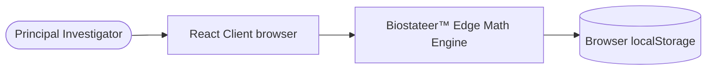
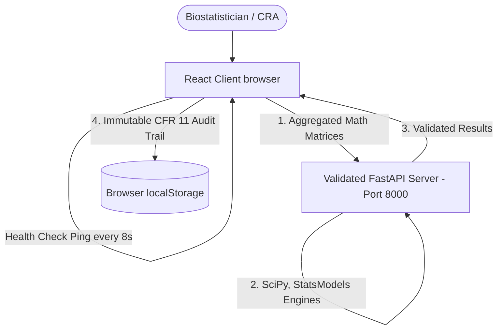
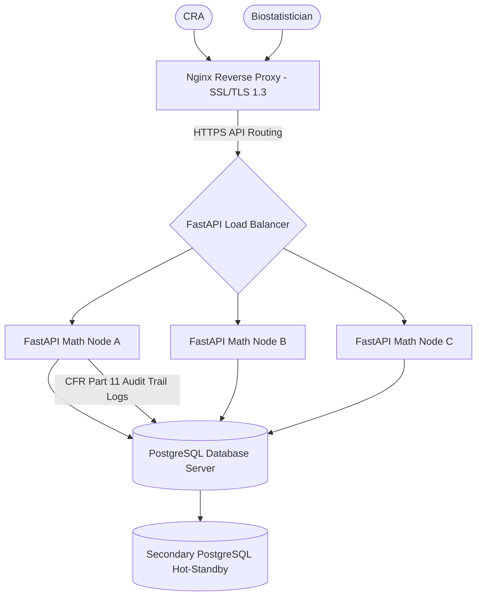

# Biostateer™ Version 1.2 — Deployment Architecture Diagram

This document illustrates the three primary deployment topologies for the Biostateer™ Clinical Analytics platform.

---

## 1. Standalone Desktop Research Mode (Local Edge)
Highly insulated, zero-database local installation. Perfect for offline statistical analysis.

---

## 2. Institutional Deployment (Hybrid Model)
Couples the browser client with a secure, containerized Python mathematical engine.

---

## 3. Enterprise Institutional Cluster (High-Throughput Model)
Full-scale clinical deployment with load-balanced Nginx proxies, multi-container clusters, and database persistence.

---

## ✍️ Verification Authority

**Dr. Bhupesh Dewan**
*Founder & Product Owner of Biostateer™*

*Copyright © 2026 Dr. Bhupesh Dewan. All Rights Reserved.*
